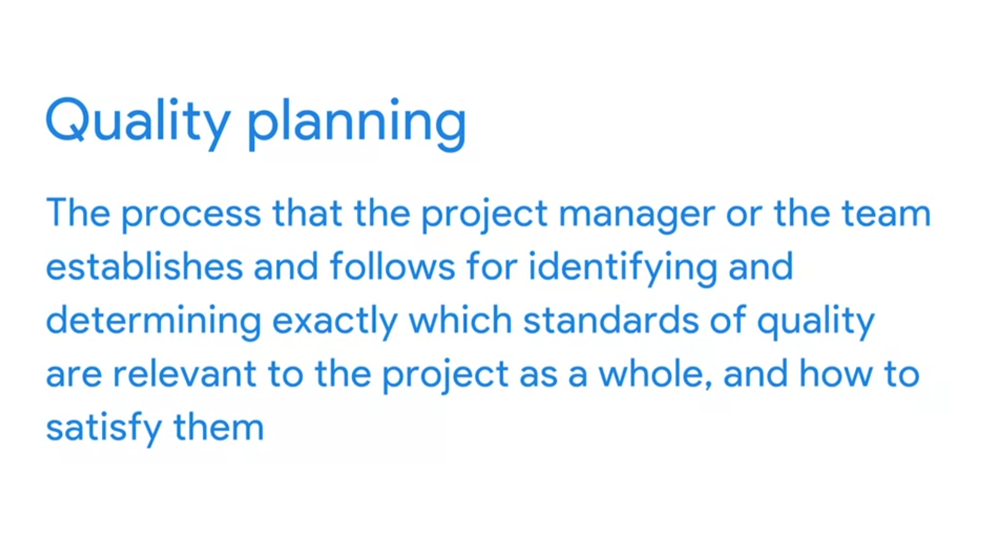
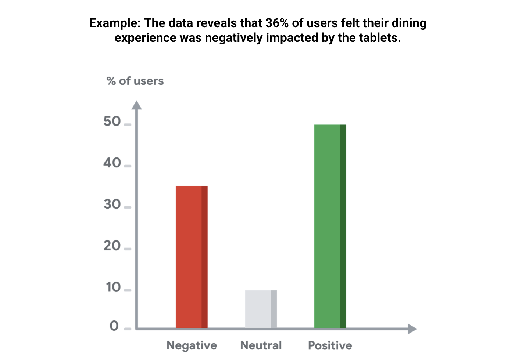

# Maintaining quality

## Evaluation presentations: Components and tips
- Tailor communications to stakeholders: When it comes to communicating important milestones to stakeholders, consider whom you are presenting to. Tailor your presentation to your audience in a way that they will understand and enjoy.
- Start with an interesting hook: Begin your presentation with an ice breaker, joke, or an interesting visual aid to get your stakeholders’ attention right away. 
- Use visuals throughout your presentation: The use of visuals creates interest and keeps the audience engaged in your presentation. 

