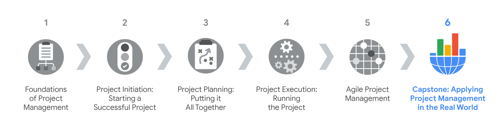
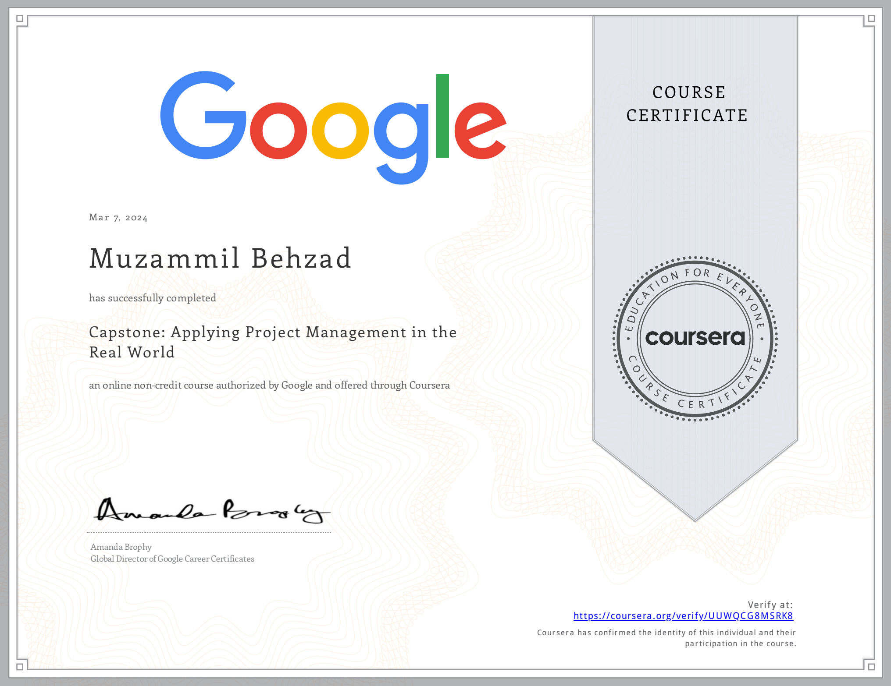

# Project Execution: Running the Project
The knowledge base contanis a specialization overview from the course [Capstone: Applying Project Management in the Real World](https://www.coursera.org/learn/applying-project-management) by Google on [Coursera](https://www.coursera.org/). It is divided into following modules:
- [Initiating a project](./Initiating%20a%20project.md)
- [Building out a project plan](./Building%20out%20a%20project%20plan.md)
- [Maintaining quality](./Maintaining%20quality.md)
- [Effective stakeholder communication](./Effective%20stakeholder%20communication.md)

Through this course, you will “observe” a project manager in a real-world scenario and complete dozens of hands-on activities. You will:
- analyze project documents to identify project requirements and evaluate stakeholders 
- complete a project charter and use it as a tool to align project scope and goals among stakeholders
- identify tasks and milestones and document and prioritize them in a project plan
- define quality management standards and explore how to effectively share qualitative data
- demonstrate your project’s impact through effective reporting 

By the end of this course, you will have developed a portfolio of project management artifacts that will demonstrate the skills you have learned throughout the entire program, such as your ability to manage stakeholders and teams, organize plans, and communicate project details. These artifacts can exhibit your career readiness when applying for jobs in the field. To further prepare you to interview for project management jobs, you will reflect on past projects, develop an “elevator pitch,” and anticipate common interview questions. Current Google project managers will continue to instruct and provide you with the strategies, tools, and resources to meet your goals.

[Here](https://www.coursera.org/account/accomplishments/verify/UUWQCG8MSRK8) is my certification for this first course.

## Certification Overview
###  Google Project Management Certification
**Project managers** are natural problem-solvers. They set the plan and guide teammates, and manage changes, risks, and stakeholders. This [Google Project Management: Professional Certificate](https://www.coursera.org/professional-certificates/google-project-management) includes over 140 hours of instruction and hundreds of practice-based assessments which will help you simulate real-world project management scenarios that are critical for success in the workplace. The content is highly interactive and exclusively developed by Google employees with decades of experience in program and project management.

**Skills you’ll gain will include**: Creating risk management plans; Understanding process improvement techniques; Managing escalations, team dynamics, and stakeholders; Creating budgets and navigating procurement; Utilizing  project management software, tools, and templates; Practicing Agile project management, with an emphasis on Scrum.

Through a mix of videos, assessments, and hands-on activities, you’ll get introduced to initiating, planning, and running both traditional and Agile projects. You’ll develop a toolbox to demonstrate your understanding of key project management elements, including managing a schedule, budget, and team.

### Certification Content

The [Google Project Management: Professional Certificate](https://www.coursera.org/professional-certificates/google-project-management) contains six courses.

- Foundations of Project Management
- Project Initiation: Starting a Successful Project
- Project Planning: Putting It All Together
- Project Execution: Running the Project
- Agile Project Management
- **Capstone: Applying Project Management in the Real World**

Most of the content is from the course itself. © Google and Coursera.